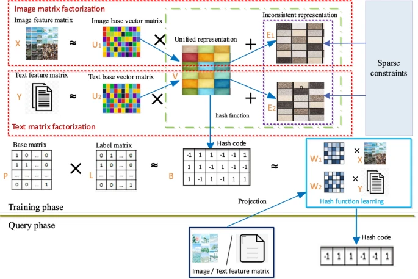
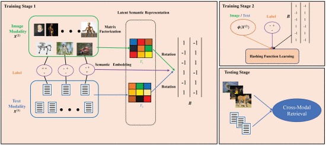
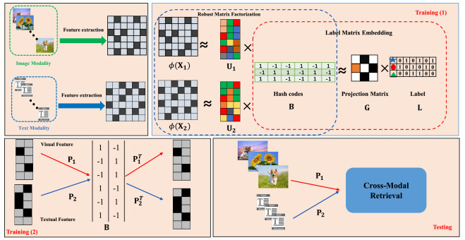
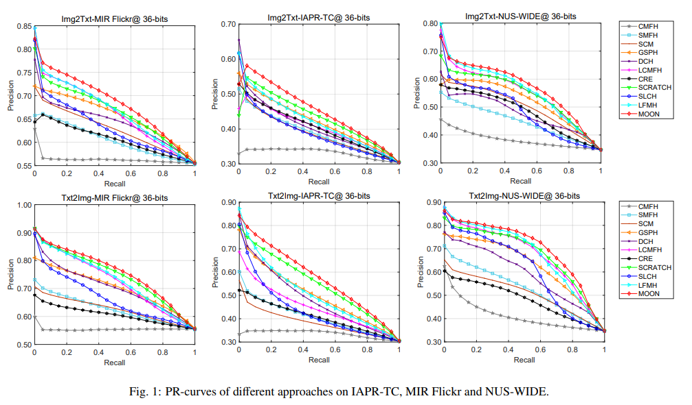
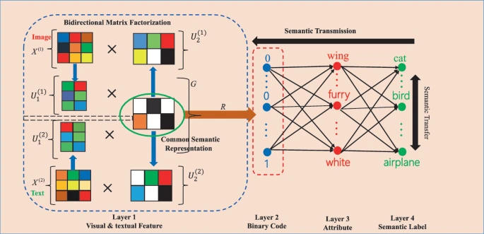
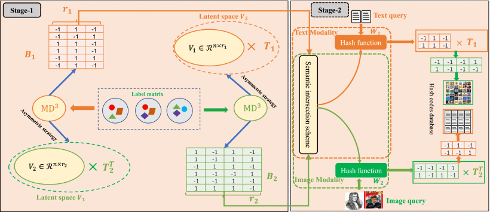
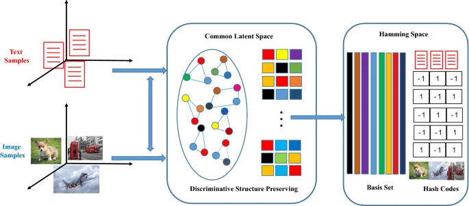
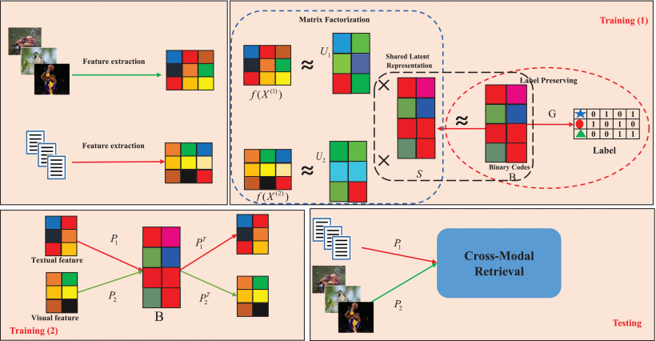

# Cross Modal Retrieval Research of PRCI-Lab

### ONION: Online Semantic Autoencoder Hashing for Cross-Modal Retrieval

*Donglin Zhang, Xiao-Jun Wu, Guoqing Chen*. **ACM Transactions on Intelligent Systems and Technology, 2023**

#### [[Paper](https://doi.org/10.1145/3572032)]  [[Code]()]

### Robust supervised matrix factorization hashing with application to cross-modal retrieval

*[Zhenqiu Shu](https://link.springer.com/article/10.1007/s00521-022-08006-6#auth-Zhenqiu-Shu), [Kailing Yong](https://link.springer.com/article/10.1007/s00521-022-08006-6#auth-Kailing-Yong), [Donglin Zhang](https://link.springer.com/article/10.1007/s00521-022-08006-6#auth-Donglin-Zhang), [Jun Yu](https://link.springer.com/article/10.1007/s00521-022-08006-6#auth-Jun-Yu), Zhengtao Yu & Xiao-Jun Wu*. **Neural Computing and Applications 2023.**

#### [[Paper](https://doi.org/10.1007/s00521-022-08006-6)]  [[Code]()]
---

### Online supervised collective matrix factorization hashing for cross-modal retrieval
*[Zhenqiu Shu](https://link.springer.com/article/10.1007/s10489-022-04189-6#auth-Zhenqiu-Shu), [Li Li](https://link.springer.com/article/10.1007/s10489-022-04189-6#auth-Li-Li), [Jun Yu](https://link.springer.com/article/10.1007/s10489-022-04189-6#auth-Jun-Yu), [Donglin Zhang](https://link.springer.com/article/10.1007/s10489-022-04189-6#auth-Donglin-Zhang), Zhengtao Yu & Xiao-Jun Wu*. **Applied Intelligence, 2022**.

#### [[Paper](https://doi.org/10.1007/s10489-022-04189-6)]  [[Code](https://github.com/liligithub5/OSCMFH)]
---

### Specific class center guided deep hashing for cross-modal retrieval
*Zhenqiu Shu a, Yibing Bai a, Donglin Zhang b, Jun Yu c, Zhengtao Yu a, Xiao-Jun Wu b*. **Information sciences, 2022**.

#### [[Paper](https://doi.org/10.1016/j.ins.2022.07.095)]  [[Code](https://github.com/zzidlezz/SCCGDH)]
---

### Unsupervised Multi-modal Hashing for Cross-Modal Retrieval
*[Jun Yu](https://link.springer.com/article/10.1007/s12559-021-09847-4#auth-Jun-Yu), [Xiao-Jun Wu](https://link.springer.com/article/10.1007/s12559-021-09847-4#auth-Xiao_Jun-Wu) & [Donglin Zhang](https://link.springer.com/article/10.1007/s12559-021-09847-4#auth-Donglin-Zhang) . **Cognitive Computation, 2022**.

#### [[Paper](https://doi.org/10.1007/s12559-021-09847-4)]  [[Code]()]
---

### Two-Stage Supervised Discrete Hashing for Cross-Modal Retrieval
*[Donglin Zhang](https://ieeexplore.ieee.org/author/37088855929); [Xiao-Jun Wu](https://ieeexplore.ieee.org/author/37085390158); [Tianyang Xu](https://ieeexplore.ieee.org/author/37085758885); [Josef Kittler](https://ieeexplore.ieee.org/author/37271983300)*. **IEEE Transactions on Systems, Man, and Cybernetics: Systems , 2022**.

#### [[Paper](https://doi.org/10.1109/TSMC.2021.3130939)]  [[Code]()]
---

### Robust and discrete matrix factorization hashing for cross-modal retrieval
*Donglin Zhang, Xiao-Jun Wu*. **Pattern Recognition, 2022**.

#### [[Paper](https://doi.org/10.1016/j.patcog.2021.108343)]  [[Code](https://github.com/zhangdlin/RDMH)]
---

### Discriminative Supervised Subspace Learning for Cross-modal Retrieval
*[Haoming Zhang](https://arxiv.org/search/cs?searchtype=author&query=Zhang%2C+H), [Xiao-Jun Wu](https://arxiv.org/search/cs?searchtype=author&query=Wu%2C+X), [Tianyang Xu](https://arxiv.org/search/cs?searchtype=author&query=Xu%2C+T), [Donglin Zhang](https://arxiv.org/search/cs?searchtype=author&query=Zhang%2C+D)*.  **arXiv preprint, 2022**.

#### [[Paper]([ https://doi.org/10.48550/arXiv.2201.11843](https://doi.org/10.48550/arXiv.2201.11843)Focus to learn more)]  [[Code]()]
---

### MOON: Multi-hash codes joint learning for cross-media retrieval
*Donglin Zhang, Xiao-Jun Wu, He-Feng Yin, Josef Kittler *. **Pattern recognition letters, 2022*1.

#### [[Paper](https://doi.org/10.1016/j.patrec.2021.07.018)]  [[Code](https://github.com/zhangdlin/MOON)]
---

### Discrete Bidirectional Matrix Factorization Hashing for Zero-Shot Cross-Media Retrieval
*[Donglin Zhang](https://link.springer.com/chapter/10.1007/978-3-030-88007-1_43#auth-Donglin-Zhang), [Xiao-Jun Wu](https://link.springer.com/chapter/10.1007/978-3-030-88007-1_43#auth-Xiao_Jun-Wu) & [Jun Yu](https://link.springer.com/chapter/10.1007/978-3-030-88007-1_43#auth-Jun-Yu) . **Pattern Recognition and Computer Vision: 4th Chinese Conference(PRCV), 2021**.

#### [[Paper](https://doi.org/10.1007/978-3-030-88007-1_43)]  [[Code]()]
---

### DAH: Discrete Asymmetric Hashing for Efficient Cross-Media Retrieval
*[Donglin Zhang](https://ieeexplore.ieee.org/author/37088855929); [Xiao-Jun Wu](https://ieeexplore.ieee.org/author/37085390158); [Tianyang Xu](https://ieeexplore.ieee.org/author/37085758885); [He-Feng Yin](https://ieeexplore.ieee.org/author/37085810810)*. **IEEE Transactions on Knowledge and Data Engineering, 2021**.

#### [[Paper](https://doi.org/10.1109/TKDE.2021.3099125)]  [[Code](https://github.com/zhangdlin/DAH)]
---

### Label Consistent Flexible Matrix Factorization Hashing for Efficient Cross-modal Retrieval
*Donglin Zhang, Xiao-Jun Wu, Jun Yu*. **ACM Transactions on Multimedia Computing, 2021**.

#### [[Paper](https://doi.org/10.1145/3446774)]  [[Code](https://github.com/zhangdlin/LFMH)]
---

### Learning latent hash codes with discriminative structure preserving for cross-modal retrieval
[Donglin Zhang](https://link.springer.com/article/10.1007/s10044-020-00893-6#auth-Donglin-Zhang), [Xiao-Jun Wu](https://link.springer.com/article/10.1007/s10044-020-00893-6#auth-Xiao_Jun-Wu) & [Jun Yu](https://link.springer.com/article/10.1007/s10044-020-00893-6#auth-Jun-Yu) *. **Pattern Analysis and Applications, 2021**.

#### [[Paper](https://doi.org/10.1007/s10044-020-00893-6)]  [[Code](https://github.com/hli1221/imagefusion-nestfuse)]
---

### Scalable Discrete Matrix Factorization and Semantic Autoencoder for Cross-Media Retrieval
*D Zhang, XJ Wu*. **IEEE Transactions on Cybernetics, 2021**.

#### [[Paper](https://doi.org/10.1007/s10044-020-00870-z)]  [[Code]()]
---

### Learning discriminative hashing codes for cross-modal retrieval based on multi-view features
*Jun Yu, Xiao-Jun Wu, Josef Kittler*. **Pattern Analysis and Applications, 2020**.

#### [[Paper](https://doi.org/10.1109/ICPR48806.2021.9412293)]  [[Code](https://github.com/thfylsty/ImageFusion_Dualbranch_Fusion)]
---

