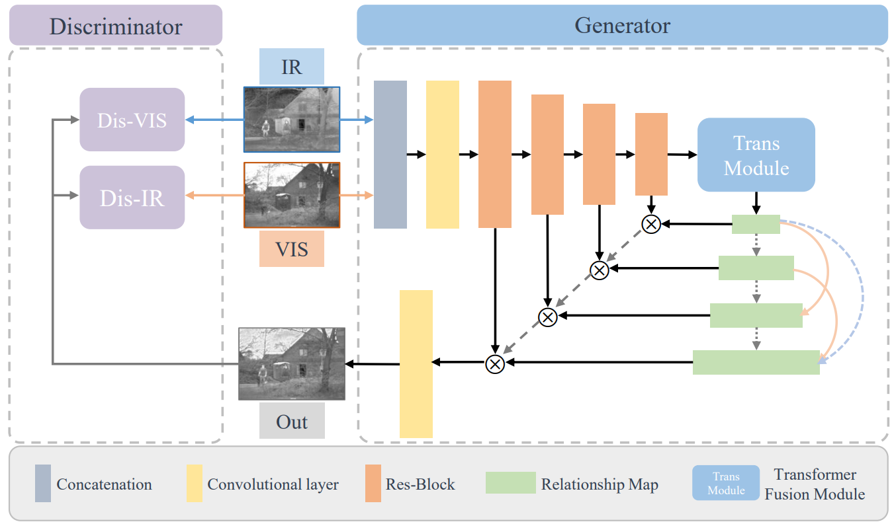
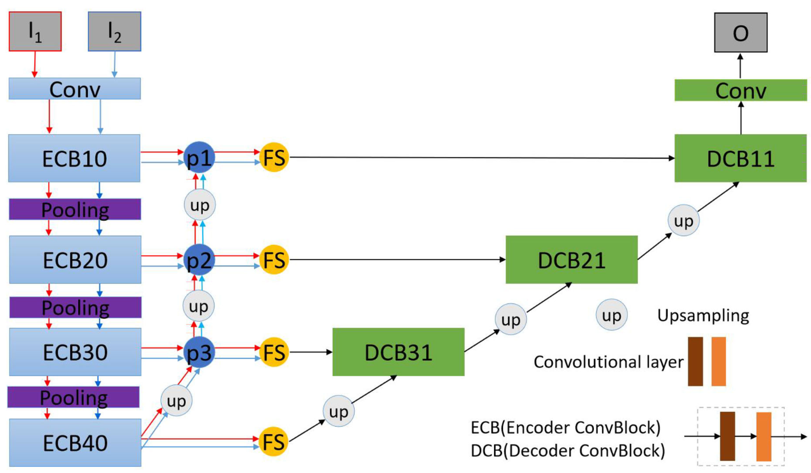
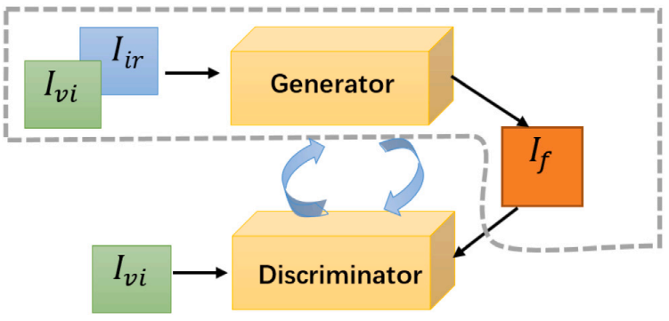
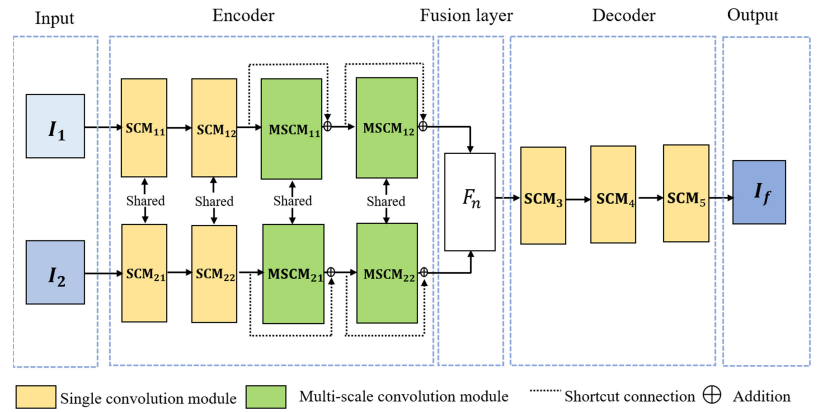
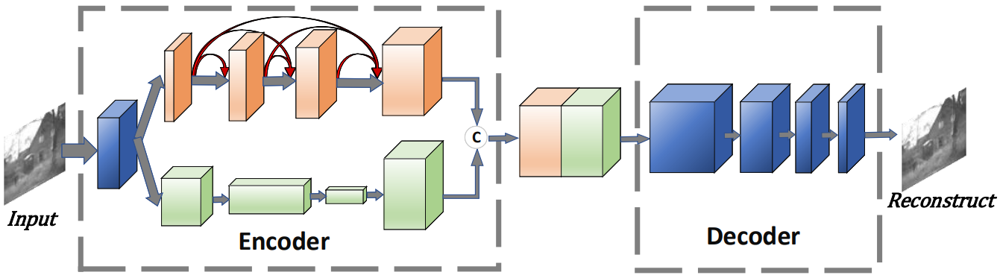

# Image Fusion Research of PRCI-Lab

### LRRNet: A Novel Representation Learning Guided Fusion Framework for Infrared and Visible Images
*[Hui Li](https://hli1221.github.io/), [Tianyang Xu](https://xu-tianyang.github.io/), Xiao-Jun Wu, Jiwen Lu, Josef Kittler*. **IEEE Transactions on Pattern Analysis and Machine Intelligence (TPAMI), 2023**.

#### [[Paper](https://doi.org/10.1109/TPAMI.2023.3268209)]  [[Code](https://github.com/hli1221/imagefusion-LRRNet)]
---

### MUFusion: A general unsupervised image fusion network based on memory unit
*Chunyang Cheng, [Tianyang Xu](https://xu-tianyang.github.io/), Xiao-Jun Wu*. **Information Fusion, 2023**.

#### [[Paper](https://doi.org/10.1016/j.inffus.2022.11.010)]  [[Code](https://github.com/AWCXV/MUFusion)]
---

### TGFuse: An Infrared and Visible Image Fusion Approach Based on Transformer and Generative Adversarial Network
*Dongyu Rao, [Tianyang Xu](https://xu-tianyang.github.io/), Xiao-Jun Wu*. **IEEE Transactions on Image Processing(TIP), 2023**.

#### [[Paper](https://doi.org/10.1109/TIP.2023.3273451)]  [[Code](https://github.com/dongyuya/TGFuse)]
---

### FPNFuse: A lightweight feature pyramid network for infrared and visible image fusion
*Zi-Han Zhang, Xiao-Jun Wu, [Tianyang Xu](https://xu-tianyang.github.io/)*. **IET Image Processing, 2022**.

#### [[Paper](https://doi.org/10.1049/ipr2.12473)]  [[Code](https://github.com/Zhang-ZiHan/FPNFuse)]
---

### MEFuse: end-to-end infrared and visible image fusion method based on multibranch encoder
*Yulu Hong, Xiao-Jun Wu, [Tianyang Xu](https://xu-tianyang.github.io/)*. **Journal of Electronic Imaging (JEI), 2022**.

#### [[Paper](https://doi.org/10.1117/1.JEI.31.3.033043)]  [[Code]()]
---

### RFN-Nest: An end-to-end residual fusion network for infrared and visible images
*[Hui Li](https://hli1221.github.io/), Xiao-Jun Wu, Josef Kittler*. **Information Fusion, 2021**.

#### [[Paper](https://doi.org/10.1016/j.inffus.2021.02.023)]  [[Code](https://github.com/hli1221/imagefusion-rfn-nest)]
---

### UNIFusion: A Lightweight Unified Image Fusion Network
*Chunyang Cheng, Xiao-Jun Wu, [Tianyang Xu](https://xu-tianyang.github.io/), Guoyang Chen*.  **IEEE Transactions on Instrumentation and Measurement (TIM), 2021**.

#### [[Paper](https://doi.org/10.1109/TIM.2021.3109379)]  [[Code](https://github.com/AWCXV/UNIFusion)]
---

### UMFA: a photorealistic style transfer method based on U-Net and multi-layer feature aggregation
*Dongyu Rao, Xiao-Jun Wu, [Hui Li](https://hli1221.github.io/), Josef Kittler, [Tianyang Xu](https://xu-tianyang.github.io/)*. **Journal of Electronic Imaging (JEI), 2021**.

#### [[Paper](https://doi.org/10.1117/1.JEI.30.5.053013)]  [[Code](https://github.com/dongyuya/UMFA)]
---

### Image fusion based on generative adversarial network consistent with perception
*Yu Fu, Xiao-Jun Wu, Tariq Durrani*. **Information Fusion, 2021**.

#### [[Paper](https://doi.org/10.1016/j.inffus.2021.02.019)]  [[Code](https://github.com/thfylsty/imagefusion_Perceptual_FusionGan)]
---

### Effective method for fusing infrared and visible images
*Yu Fu, Xiao-Jun Wu, Josef Kittler*. **Journal of Electronic Imaging (JEI), 2021**.

#### [[Paper](https://doi.org/10.1117/1.JEI.30.3.033013)]  [[Code]()]
---

### MSC-Fuse: An Unsupervised Multi-scale Convolutional Fusion Framework for Infrared and Visible Image
*Guo-Yang Chen, Xiao-Jun Wu, [Hui Li](https://hli1221.github.io/), [Tianyang Xu](https://xu-tianyang.github.io/)*. **Image and Graphics: 11th International Conference(ICIG), 2021**.

#### [[Paper](https://link.springer.com/chapter/10.1007/978-3-030-87355-4_4)]  [[Code]()]
---

### NestFuse: An Infrared and Visible Image Fusion Architecture based on Nest Connection and Spatial/Channel Attention Models
*[Hui Li](https://hli1221.github.io/), Xiao-Jun Wu, Tariq S. Durrani*. **IEEE Transactions on Instrumentation and Measurement (TIM), 2020**.

#### [[Paper](https://doi.org/10.1109/TIM.2020.3005230)]  [[Code](https://github.com/hli1221/imagefusion-nestfuse)]
---

### MDLatLRR: A novel decomposition method for infrared and visible image fusion
*[Hui Li](https://hli1221.github.io/), Xiao-Jun Wu, Josef Kittler*. **IEEE Transactions on Image Processing (TIP), 2020**.

#### [[Paper](https://doi.org/10.1109/TIP.2020.2975984)]  [[Code](https://github.com/hli1221/imagefusion_mdlatlrr)]
---

### A Dual-branch Network for Infrared and Visible Image Fusion
*Yu Fu, Xiao-Jun Wu*. **25th International Conference on Pattern Recognition (ICPR), 2020**.

#### [[Paper](https://doi.org/10.1109/ICPR48806.2021.9412293)]  [[Code](https://github.com/thfylsty/ImageFusion_Dualbranch_Fusion)]
---

