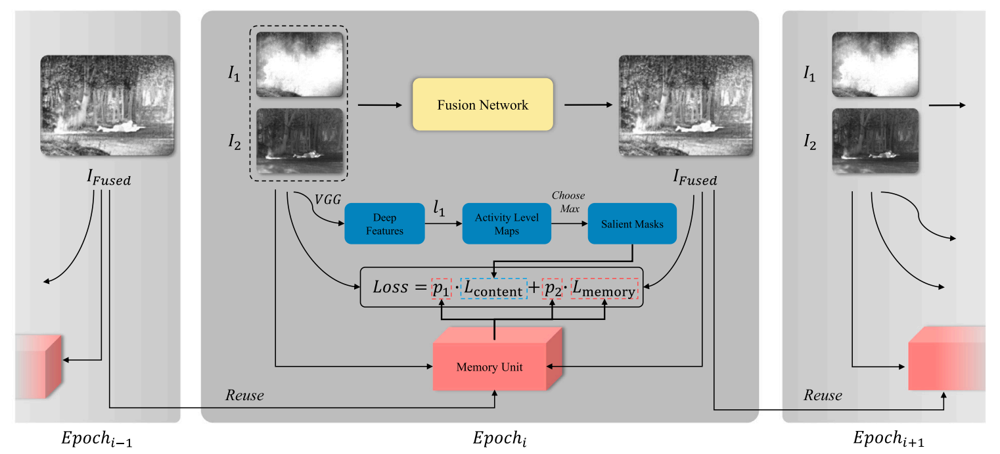
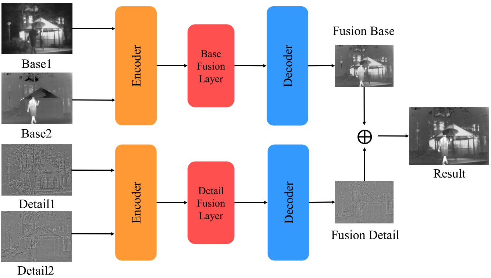

# Image Fusion Research of PRCI-Lab

### LRRNet: A Novel Representation Learning Guided Fusion Framework for Infrared and Visible Images
*[Hui Li](https://hli1221.github.io/), [Tianyang Xu](https://xu-tianyang.github.io/), Xiao-Jun Wu, Jiwen Lu, Josef Kittler*. **TPAMI, 2023**.

#### [[Paper](https://doi.org/10.1109/TPAMI.2023.3268209)]  [[Code](https://github.com/hli1221/imagefusion-LRRNet)]
---

### MUFusion: A general unsupervised image fusion network based on memory unit
*Chunyang Cheng, [Tianyang Xu](https://xu-tianyang.github.io/), Xiao-Jun Wu*. **Information Fusion, 2023**.

#### [[Paper](https://doi.org/10.1016/j.inffus.2022.11.010)]  [[Code](https://github.com/AWCXV/MUFusion)]
---

### RFN-Nest: An end-to-end residual fusion network for infrared and visible images
*[Hui Li](https://hli1221.github.io/), Xiao-Jun Wu, Josef Kittler*. **Information Fusion, 2021**.

#### [[Paper](https://doi.org/10.1016/j.inffus.2021.02.023)]  [[Code](https://github.com/hli1221/imagefusion-rfn-nest)]
---

### UNIFusion: A Lightweight Unified Image Fusion Network
*Chunyang Cheng, Xiao-Jun Wu, Tianyang Xu, Guoyang Chen*.  **IEEE Transactions on Instrumentation and Measurement, 2021**.

#### [[Paper](https://doi.org/10.1109/TIM.2021.3109379)]  [[Code](https://github.com/AWCXV/UNIFusion)]
---
